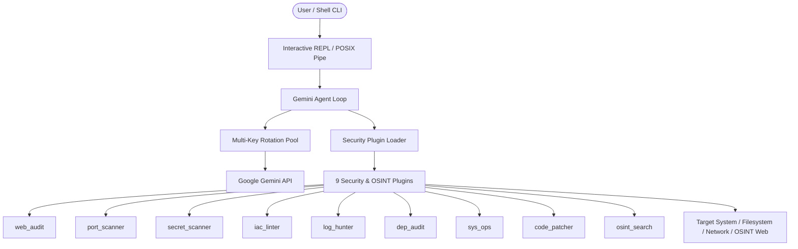

# ⚡ AGY — Gemini Sec Agent (Gemini Super CLI)

<p align="center">
  
  
  
  
</p>

> **Autonomous AI-Powered Cybersecurity Workstation & Terminal Assistant driven by Google Gemini API.**  
> Built from scratch with zero placeholders, full security-first interfacing, multi-key rotation pools, and 9 built-in offensive, defensive & OSINT security plugins integrated into a native function-calling agent loop.

```
  █████╗  ██████╗ ██╗   ██╗    ███████╗███████╗██████╗ 
 ██╔══██╗██╔════╝ ╚██╗ ██╔╝    ██╔════╝██╔════╝██╔══██╗
 ███████║██║  ███╗ ╚████╔╝     ███████╗█████╗  ██║  ██║
 ██╔══██║██║   ██║  ╚██╔╝      ╚════██║██╔══╝  ██║  ██║
 ██║  ██║╚██████╔╝   ██║       ███████║███████╗██████╔╝
 ╚═╝  ╚═╝ ╚═════╝    ╚═╝       ╚══════╝╚══════╝╚═════╝ 
================================================================
 ACTIVE  Model: gemini-2.5-flash | Key Pool: Enabled | Plugins: 9
================================================================
```

---

## 💡 Key Highlights

* 🧠 **Autonomous Function-Calling Loop:** Gemini intelligently decides when to invoke any of the 9 local plugins, inspects raw system/network data, and synthesizes expert security insights.
* 🔎 **OSINT Social & Telecom Reconnaissance:** Scan username footprints across 20+ social platforms and analyze phone numbers (E.164, carrier prefix, WhatsApp/Telegram lookup, and Google dorks) via `/search`.
* 🔄 **Multi-Key API Rotation Pool:** Seamlessly rotates through multiple Gemini API keys upon encountering HTTP 429 (`RESOURCE_EXHAUSTED`), preventing session throttling.
* 💻 **Interactive Cyberpunk REPL:** ANSI color scheme, live spinners, rich text panels, and native Windows PowerShell UTF-8 rendering.
* 🔌 **Direct Plugin Execution:** Bypass the LLM to run plugins directly via `/run <plugin>` in REPL or `agy --run-plugin <plugin>` in CI/CD automation pipelines.
* 🛠️ **Hot-Reloadable Architecture:** Modify or create plugins in `plugins/*.mjs` and instantly reload them with `/reload` without restarting your terminal.
* 🛡️ **Fail-Safe Security Measures:** Surgical file patching protected by automatic `.bak` backups and deep regex/Shannon entropy secret masking.

---

## 🏗️ System Architecture



---

## 🛡️ Built-in Security & DevSecOps Plugins

| Plugin | Category | Description | Capabilities |
| :--- | :---: | :--- | :--- |
| **`osint_search`** | OSINT / Recon | Social media username & phone number footprint investigator. | 20+ platform checks (GitHub, Reddit, X, TikTok, Telegram), carrier prefix lookup, dorks. |
| **`web_audit`** | Recon / DefSec | Audits HTTP security headers, SSL certificates, and DNS records. | Checks HSTS, CSP, X-Frame, CORS, SSL expiry, A/AAAA/MX records. |
| **`port_scanner`** | Recon / Network | Concurrency-controlled async TCP port scanner. | Scans ports, grabs banners, flags dangerous open services. |
| **`secret_scanner`** | DevSecOps | Credential leak detector with Shannon entropy matching. | Finds AWS keys, GitHub PATs, JWTs, private keys with masking. |
| **`iac_linter`** | Container Security | Security linter for Dockerfile & Docker Compose files. | Detects root execution, privileged mode, socket mounts. |
| **`log_hunter`** | SOC Threat Hunt | Web & auth log parser for attack pattern detection. | Identifies SQLi, XSS, Path Traversal, Command Injection, Brute force. |
| **`dep_audit`** | Supply Chain | Supply chain security auditor for `package.json` & `requirements.txt`. | Flags wildcards, insecure HTTP sources, hijacked packages. |
| **`sys_ops`** | Host Posture | Host privilege inspector & local network state auditor. | Lists listening TCP ports, admin/root privileges, interface IPs. |
| **`code_patcher`** | Auto-Remediation | Surgical file patcher with automatic backup generation. | Replaces targeted lines with timestamped `.bak` backup & rollback. |

---

## 🚀 Installation & Setup

### 1. Clone & Install Dependencies
```bash
git clone https://github.com/icebergf6/gemini-sec-agent.git
cd gemini-sec-agent
npm install
```

### 2. Configure Environment Variables
Create a `.env` file in the project root:
```env
# Single Gemini API Key:
GEMINI_API_KEY="AIzaSyYourGeminiApiKeyHere"

# Or comma-separated key pool for auto-rotation (Recommended):
GEMINI_API_KEYS="AIzaSyKey1...,AIzaSyKey2...,AIzaSyKey3..."

# Optional default model (Default: gemini-2.5-flash):
GEMINI_MODEL="gemini-2.5-flash"
```

### 3. Link Command Globally (Optional)
To invoke `agy` or `gemini-cli` from any directory:
```bash
npm link
```

---

## 💻 Usage Guide

### 1. Interactive REPL Mode
Launch the interactive agent console:
```bash
agy
# or
node bin/agy.mjs
```

#### Slash Commands inside REPL:
- `/kit` — Open the interactive OSINT & Intel Research Toolkit hub.
- `/username <user>` — Scan social media footprints across 20+ platforms (interactive prompt if empty).
- `/phone <number>` — Phone number intelligence, Indonesian carrier prefix & direct chat links.
- `/info <query>` — Deep AI OSINT research & threat landscape investigation via Gemini.
- `/search <target>` — Universal OSINT search (auto-detects phone vs username).
- `/help` — Display command guide and CLI flags.
- `/plugins` — List all registered plugins and parameter schemas.
- `/run <plugin> [args]` — Direct execution of a plugin with JSON arguments.
- `/model [name]` — View active model or switch models on the fly.
- `/keys` — Display key rotation pool status (masked for privacy).
- `/addkey <key>` — Add a new API key into the active session pool.
- `/reload` — Hot-reload plugin code from `plugins/` without restarting.
- `/clear` — Clear terminal screen and reprint banner.
- `/exit` — Gracefully terminate REPL session.

---

### 2. One-Shot Prompt & Pipeline Automation

#### OSINT & Research CLI Flags:
```bash
# OSINT Username Lookup:
agy --username octocat

# OSINT Phone Number Investigation:
agy --phone +628123456789

# Deep AI Intel & Topic Investigation:
agy --info "CVE-2024-3094 xz backdoor supply chain"

# Interactive Toolkit Guide:
agy --kit
```

#### One-Shot Prompt:
```bash
agy -p "Audit port 80, 443, dan 3306 pada 127.0.0.1"
```

#### Direct Plugin Execution (Without LLM):
```bash
agy --run-plugin web_audit '{"target":"https://example.com"}'
agy --run-plugin secret_scanner '{"path":"."}'
agy --run-plugin iac_linter '{"target":"."}'
```

#### Structured JSON Output (For CI/CD & `jq`):
```bash
agy --run-plugin port_scanner '{"target":"127.0.0.1","ports":"80,443"}' --json
```

#### Pipe Web Server Logs directly into AGY:
```bash
cat /var/log/nginx/access.log | agy "Analisis apakah ada indikasi serangan SQL Injection atau XSS"
```

---

## 🧩 Writing Custom Plugins

Every plugin in `plugins/*.mjs` is an ES module exporting a `declaration` schema and an `execute` function handler:

```javascript
export const declaration = {
  name: "custom_scanner",
  description: "Audits target infrastructure for vulnerabilities.",
  parameters: {
    type: "OBJECT",
    properties: {
      target: { type: "STRING", description: "IP address or domain" }
    },
    required: ["target"]
  }
};

export async function execute(args) {
  // Your security analysis logic
  return {
    target: args.target,
    status: "SECURE",
    timestamp: new Date().toISOString()
  };
}
```

---

## 🔒 Security Mandates & Safety Controls

1. **Secret Protection:** API keys and sensitive tokens are never printed in plain text or logged to disk.
2. **Reversible Remediation:** All file edits performed by `code_patcher` automatically write a timestamped `.bak` backup file before modification.
3. **Least Privilege Enforcement:** System checks operate strictly in read-only mode unless explicitly asked to patch files.

---

## 📄 License & Credits

Created and maintained by **LEO SYAFIQ**.  
Released under the [MIT License](LICENSE).
